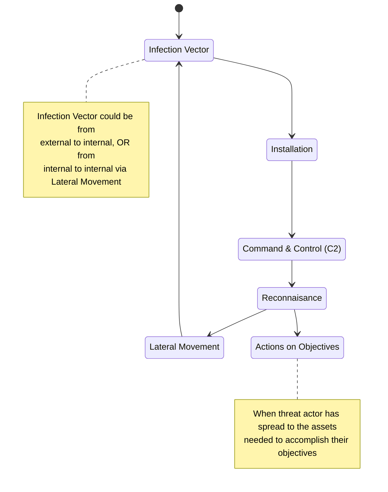

Within Cyber Threat Intelligence, there are a few prevalent models for categorizing/analyzing intrusions. These are the [Diamond Model](https://example.com), [MITRE ATT&CK](https://example.com), and of course, the [Lockheed Martin Cyber Threat Kill Chain](https://www.lockheedmartin.com/en-us/capabilities/cyber/cyber-kill-chain.html). While these models are extremely helpful, I take some umbrage with the lattermost model—the kill chain.

## What is the Kill Chain?

In a quick summary, the kill chain is 7 steps—or, 7 links in a chain—that an attacker goes through in an intrusion. The seven steps are as follows:

1. Reconnaisance (Recon)
2. Weaponization
3. Delivery
4. Exploitation
5. Installation
6. Command & Control (C2)
7. Actions on Objectives

_Figure 1: the [Cyber Kill Chain graphic from their site](https://www.lockheedmartin.com/content/dam/lockheed-martin/rms/photo/cyber/THE-CYBER-KILL-CHAIN-body.png.pc-adaptive.990.medium.png)._

## Okay, so this seems great, what's the problem?

Straight up, for defending, this isn't actually a helpful model. Let's break it down.

### Steps 1 and 2

Steps 1 and 2 aren't actually visible from a defender's perspective in an intrusion. Yes, an attacker does have to do these things (sorta, I'll get to that in a minute) in order to perform / complete an attack.

### Steps 2 and 4

Steps 2 and 4 _require_ (or at least _heavily imply_ the requirement) that there is an exploit in use during an attack, which is just not true at all. There are plenty of attacks that don't make use of exploits. They might rely on credential access, or on social engineering. While exploits are scary, they are not the sole Infection Vector type.

### Step 7

Not to mention the fact that step 7 has _so much more going on in it than it implies_. Most intrusions involve lots of Lateral Movement (LM) in order to achieve those "Actions on Objectives". Categorizing all of LM, Discovery, Credential Access, etc. under the step 7 umbrella is a disservice to professionals trying to understand an intrusion, and what an actor did or does.

## Solution

I'd propose the following adaptation to the Cyber Kill Chain:

1. Infection Vector
2. Installation
3. Command & Control (C2)
4. Reconnaisance
5. Lateral Movement
6. Actions on Objectives

It really isn't much of a chain per se, when many of the steps are cyclical within an intrusion. Here's a diagram that would showcase this better.

